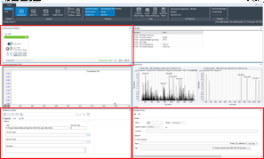

.. _agilent-config:

Agilent Configuration
=======================

.. _third-party-reqs:

Software Requirements
***********************

The Agilent Rapidfire-6560 workflow requires some additional software installation and configuration on top of the ``autonoms`` install. 

The following software must be installed manually: 

* Agilent MassHunter Workstation Data Acquisition (version >= 11.0)
* Pacific Northwest National Laboratory (PNNL) PreProcessor (version >= 3.0) (`link <https://pnnl-comp-mass-spec.github.io/PNNL-PreProcessor>`_)
* Agilent RapidFire UI (version >= 6.1.1.2114)
* MSConvert (version >= 3.0.22173) available via `ProteoWizard <https://proteowizard.sourceforge.io/download.html>`_
* Skyline (version >= 22.2.0.351) (`link <https://skyline.ms/project/home/software/Skyline/begin.view>`_) 

Agilent MassHunter Configuration
**********************************

AutonoMS currently relies on GUI element interaction with Agilent software. MassHunter allows for custom GUI layout configurations in data acquisition, so the layout must be configured to 
contain the necessary GUI elements for AutonoMS to use. Three elements must be present in the configured layout: The "Instrument Status", "Method Editor", and "Sample Run" panes. These elements are 
shown in the screenshot below boxed in red. 

Configuration file
********************

A primary purpose of the configuration toml file is to point AutonoMS to the locations of the third-party executables. After installing the software described 
:ref:`above <third-party-reqs>`, the configuration file must be updated accordingly. The ``Start_MassHunter_S.bat`` and ``MHFileSplitter.exe`` will be found in the 
software install files from the Agilent installations of the MassHunter and RapidFire software.

Note that the example configuration file uses a ``.lnk`` link for the Skyline executable. The ``Skyline.exe`` executable can be referenced directly in your configuration file. 

The ``rapid_fire_data_dir`` corresponds to the top-level directory into which RapidFire/MassHunter is configured to deposit data. 

The ``rf_ip`` entry corresponds to the RapidFire IP address on the local network and can be found under ``System Tools -> Network Settings`` in the RapidFire UI program. 